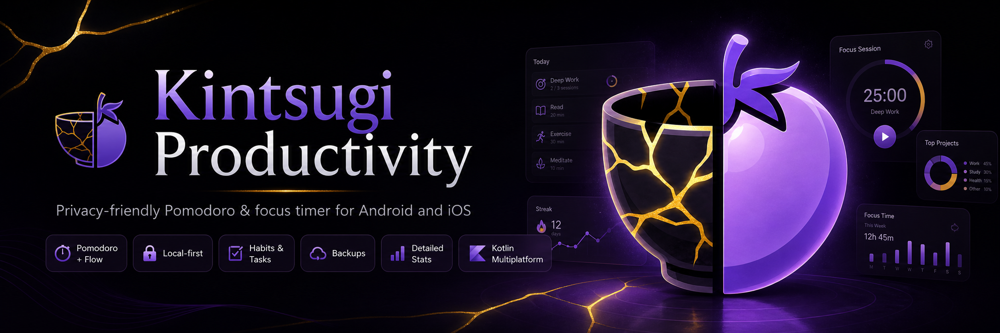

<p align="center">
  
</p>

<h1 align="center">Kintsugi Productivity</h1>

<p align="center">
  <strong>A private, local-first Pomodoro and flow timer for Android and iOS, built with Kotlin Multiplatform.</strong>
</p>

<p align="center">
  <a href="COPYING.md"></a>
  <a href="https://kotlinlang.org/docs/multiplatform.html"></a>
  <a href="https://www.jetbrains.com/lp/compose-multiplatform/"></a>
  
</p>

<p align="center">
  Protect deep-work time, track habits and tasks, review meaningful focus stats, and keep your data under your control.
</p>

---

## 📚 Table of Contents

- [🔎 Overview](#overview)
- [✨ Highlights](#highlights)
- [🚦 Platform Status](#platform-status)
- [📦 Download](#download)
- [🧭 Feature Tour](#feature-tour)
- [🛠️ Build from Source](#build-from-source)
- [🤖 Android Flavors](#android-flavors)
- [🗂️ Project Layout](#project-layout)
- [🧰 Tech Stack](#tech-stack)
- [🧪 Development](#development)
- [🔒 Privacy](#privacy)
- [📄 License](#license)
- [🙏 Acknowledgements](#acknowledgements)

<a id="overview"></a>

## 🔎 Overview

Kintsugi Productivity is a privacy-friendly focus app for people who want structure without turning productivity into another feed to check.

It combines Pomodoro sessions, open-ended count-up flow tracking, habits, one-time tasks, labels, reminders, backups, exports, and detailed statistics in a local-first app. The shared user interface is built with Compose Multiplatform, with Android and iOS platform integrations where each system needs native behavior.

<a id="highlights"></a>

## ✨ Highlights

- ⏱️ **Two focus modes**: run classic Pomodoro countdowns or open-ended count-up flow sessions.
- 🧩 **Habits, tasks, and labels**: organize focus time by project, routine, or one-off work.
- 📊 **Actionable statistics**: review timelines, heatmaps, history charts, focus distribution, focus/break ratios, and editable sessions.
- 🔐 **Local-first data ownership**: store productivity data on-device, then export or back it up when needed.
- ☁️ **Flexible backup options**: use manual backups, Android local backups, Google Drive in the Google flavor, or iCloud support on iOS.
- 🎨 **Deep customization**: tune themes, timer display, notifications, sounds, vibration, torch, fullscreen mode, and focus protection.
- 🇮🇷 **Persian Locale & RTL**: custom IRANSans typography for Persian languages alongside native RTL support.
- 🧱 **Real Kotlin Multiplatform architecture**: share Compose UI and business logic while keeping Android and iOS integrations native.

<a id="platform-status"></a>

## 🚦 Platform Status

| Platform | Status | Notes |
| --- | --- | --- |
| 🤖 Android | Release-ready source and APK builds | `google` and `fdroid` flavors are available. GitHub Releases currently publish Android APKs. |
| 🍎 iOS | Source included; Xcode distribution required | The `iosApp` project includes the native host, iCloud backup code, bundled sounds, RevenueCat bridge, and Live Activity extension. Public distribution still requires Apple signing, archiving, TestFlight, or App Store Connect. |

**🏷️ Current version:** `3.2.0-kintsugi`  
**🤖 Android versionCode:** `356`  
**🍎 iOS bundle id:** `app.kintsugi.productivity`

<a id="download"></a>

## 📦 Download

Android APKs are published through GitHub Releases when available.

Current release artifacts:

- `kintsugi-3.2.0-kintsugi-google-release.apk`
- `kintsugi-3.2.0-kintsugi-fdroid-release.apk`
- `SHA256SUMS.txt`

> [!IMPORTANT]
> The current Android release build is signed with the debug signing config. Replace it with a private release keystore before publishing production builds outside this repository.

iOS does not produce an APK-style artifact. Build and distribute the iOS app through Xcode using Apple signing, TestFlight, or App Store Connect.

<a id="feature-tour"></a>

## 🧭 Feature Tour

### ⏱️ Focus and Session Flow

- 🍅 Pomodoro work sessions with short and long breaks.
- ⏳ Count-up sessions for open-ended deep work.
- 🧮 Break-budget tracking while using the count-up flow.
- 👆 Gesture controls:
  - tap to start or pause
  - swipe to skip or stop
  - swipe up to add time
- 📝 Finished-session review with labels, interruptions, notes, and focus/break metadata.
- ⚙️ Optional auto-start behavior for focus and break sessions.

### ✅ Planning and Tracking

- ✅ **Habit and one-time task management.**
- 🥇 **MVE vs Goal Tracking**: Each habit or task can be completed at two different levels (MVE or Goal). Long-press a card for explicit selection or quick-tap the circle icon to cycle through levels.
- 🇮🇷 **RTL & Persian Typography**: globally integrated IRANSans font family for Persian locales alongside RTL-friendly layouts and localized calendar/day selectors.
- 🏷️ **Custom labels** with archive, duplicate, reorder, and color options.
- ⏲️ **Per-label timer profiles** with custom durations and long-break behavior.
- ✏️ **Editable history** and manual session creation.
- 🗃️ **Archived-label filtering** with automatic unarchiving when reused.
- 📅 **Daily and weekly focus summaries.**
- 📈 **Heatmaps, timelines, history charts**, focus distribution, and focus/break ratio views.

### 🔐 Privacy, Backup, and Portability

- 🗄️ Local Room database: `kintsugi-db`.
- 💾 Manual backup and restore.
- 📤 CSV and JSON export.
- 🤖 Android local auto-backup through WorkManager.
- ☁️ Google Drive backup in the Google Android flavor.
- 🍎 iCloud backup and restore support on iOS.
- 🚫 No ads or analytics. See [PRIVACY_POLICY.md](PRIVACY_POLICY.md).

### 🔌 System Integration

- ⏱️ Android foreground timer service.
- 🔔 Android alarms, reminders, notification channels, Do Not Disturb integration, lock-screen behavior, fullscreen mode, vibration, torch, and custom sounds.
- ▶️ Google Play review, update, billing, and Drive integrations in the Google flavor.
- 🟢 F-Droid flavor with Google-specific services removed or replaced with safe stubs.
- 🍎 iOS Swift host, iCloud documents, app groups, background refresh registration, bundled notification sounds, and ActivityKit Live Activity support.

<a id="build-from-source"></a>

## 🛠️ Build from Source

### 📋 Requirements

- ☕ JDK 17 or newer.
- 🤖 Android Studio with the Android SDK installed.
- 🍎 Xcode and an iOS SDK compatible with the checked-in project settings.

The iOS app target is configured with deployment target `18.2`. The Live Activity extension target is currently configured as `26.0`.

### 🤖 Android

Clone the repository:

```bash
git clone https://github.com/alifazelidehkordi/kintsugi_preview.git
cd kintsugi_preview
```

Build debug APKs:

```bash
./gradlew :composeApp:assembleGoogleDebug
./gradlew :composeApp:assembleFdroidDebug
```

Build release APKs:

```bash
./gradlew :composeApp:assembleRelease
```

Generated APKs are written under:

```text
composeApp/build/outputs/apk/
```

Useful release outputs:

```text
composeApp/build/outputs/apk/google/release/composeApp-google-release.apk
composeApp/build/outputs/apk/fdroid/release/composeApp-fdroid-release.apk
```

### 🍎 iOS

Open the Xcode project:

```bash
open iosApp/iosApp.xcodeproj
```

Before building for a device, TestFlight, or App Store distribution, review:

- Apple Development Team and signing certificates.
- Bundle identifiers in `iosApp/Configuration/Config.xcconfig`.
- iCloud containers and app group entitlements.
- RevenueCat keys in `iosApp/iosApp/Info.plist`.
- Live Activity extension target settings.

The iOS project includes the native host app, shared Compose entry point, iCloud backup implementation, local file import/export prompts, notification handling, timer state persistence, RevenueCat bridge, and ActivityKit Live Activity updates.

<a id="android-flavors"></a>

## 🤖 Android Flavors

| Flavor | Purpose | Includes |
| --- | --- | --- |
| `google` | Play Store style build | Google Drive backup, Google Play billing, review flow, update flow, and Play Services integration. |
| `fdroid` | Open-source distribution build | Google-specific services removed or replaced with safe stubs. |

<a id="project-layout"></a>

## 🗂️ Project Layout

```text
composeApp/
  src/commonMain/        Shared Compose UI, navigation, resources, timer logic, settings, stats, backups, labels, habits
  src/androidMain/       Android app shell, notifications, alarms, local backups, permissions, sounds
  src/androidGoogle/     Google Drive backup, RevenueCat/Google Play purchases, in-app updates, review flow
  src/androidFdroid/     F-Droid-safe backup and billing stubs
  src/iosMain/           iOS database, backup, notifications, billing bridge, Live Activity bridge, platform services

iosApp/                  Native iOS host app, Xcode project, sounds, entitlements, Live Activity extension
gradle/                  Version catalog and Gradle wrapper files
composeApp/schemas/      Room database schemas
docs/                    Architecture and platform notes
scripts/                 Release and maintenance scripts
```

Important modules and files:

| Path | Purpose |
| --- | --- |
| `KintsugiApp.kt` | Shared app shell, splash, theme, navigation, and snackbar handling. |
| `main/` | Timer screen, dial controls, finished-session flow, and navigation sheet. |
| `bl/TimerManager.kt` | Core timer state machine. |
| `data/local/` | Room database, DAOs, repositories, migrations, sessions, labels, timer profiles, and habits. |
| `backup/` | Manual backup, restore, CSV export, JSON export, and cloud/local backup UI. |
| `stats/` | Overview, timeline, history charts, heatmap, focus distribution, and session editing. |
| `settings/` | Reminders, notifications, UI, timer profiles, permissions, about, acknowledgements, and license screens. |
| `iosApp/iosApp/KintsugiLiveActivityManager.swift` | Swift side of ActivityKit updates. |
| `iosApp/KintsugiInProgress/` | Live Activity UI, assets, and preview states. |

<a id="tech-stack"></a>

## 🧰 Tech Stack

- Kotlin `2.3.0`
- Compose Multiplatform `1.10.0`
- Android Gradle Plugin `8.13.2`
- Room Multiplatform with KSP
- DataStore Preferences
- Koin dependency injection
- Kotlinx Serialization and DateTime
- Vico charts
- Compottie/Lottie animations
- Kermit logging
- Android WorkManager, Play Core, Google Drive API, and RevenueCat KMP
- iOS Swift host, ActivityKit, iCloud Documents, app groups, and background task scheduling

<a id="development"></a>

## 🧪 Development

Run checks:

```bash
./gradlew :composeApp:check
./gradlew spotlessCheck
```

Run tests:

```bash
./gradlew :composeApp:allTests
./gradlew :composeApp:testGoogleDebugUnitTest
./gradlew :composeApp:connectedAndroidTest
```

Common local files such as build outputs, release APKs, signing keys, `.env` files, and assistant-specific workflow notes are ignored by Git. Keep secrets and local-only notes out of commits.

<a id="privacy"></a>

## 🔒 Privacy

Kintsugi is designed around local ownership of productivity data. The app supports export and backup flows so users can move their data without depending on a hosted account system.

Read the full policy in [PRIVACY_POLICY.md](PRIVACY_POLICY.md).

<a id="license"></a>

## 📄 License

Kintsugi Productivity is licensed under the GNU General Public License v3.0. See [COPYING.md](COPYING.md).

<a id="acknowledgements"></a>

## 🙏 Acknowledgements

Kintsugi is inspired by Goodtime and reworked around Kintsugi branding, habit/task planning, backup flows, iOS support, and a Kotlin Multiplatform architecture.
